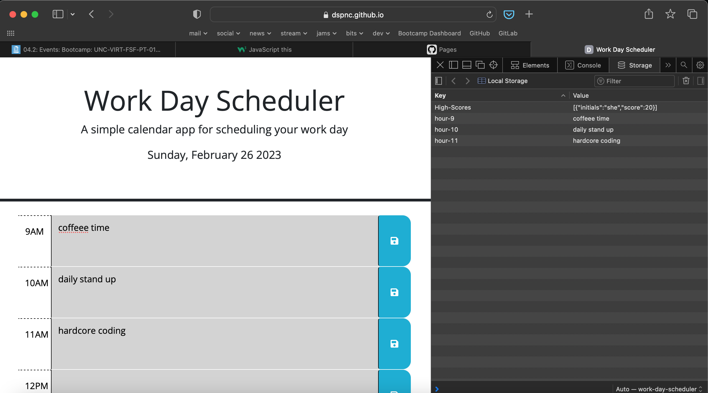

# work-day-scheduler

A simple calendar application that allows a user to save events for each hour of the day in the browser, featuring dynamically updated HTML and CSS powered by jQuery

- What was your motivation? 
The motivation for this application is to utilize/practice jquery to practice dynamic DOM manipulation and using localStorage to have data persist in the browser upon reloading.

- Why did you build this project? 
I built this project to demonstrate the ability to dynamically update a web page by using jQuery to call functions on DOM objects and adjust their CSS classes depending on different criteria, such as the time.

- What problem does it solve?
The web application solves the problem of being able to build a page that can store data that persists in the browser, and can dynamically change its HTML/CSS automatically with jQuery functions.

- What did you learn?
I learned how to effectively utilize jQuery to adjust the classes of different DOM elements dynamically, by calling functions that can compare time using dayjs() and then update CSS automatically depending on the criteria. I also practiced iterating through jQuery objects using the $(this).each(function()) to be able to look at all different time-blocks and run the javascript functions on each one.

## License

MIT License

---

Screenshot

link: https://dspnc.github.io/work-day-scheduler